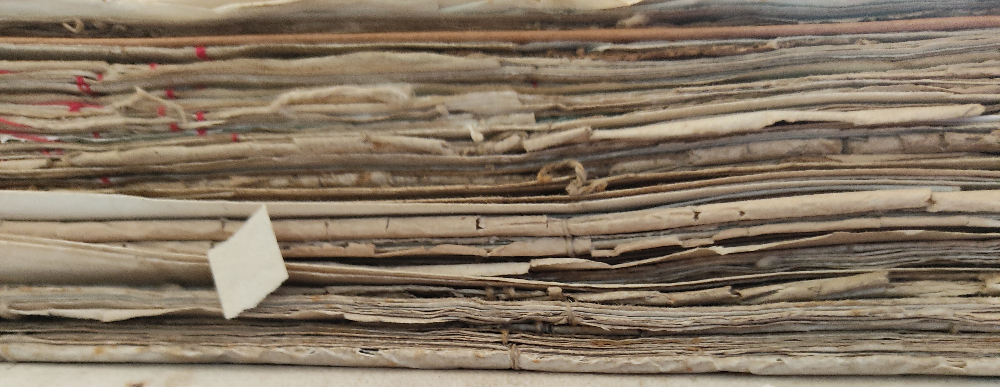

# HemerotecaBNE Extension: Descarga masiva de prensa histórica de Prensa Histórica MCU

Extensión para descargar masivamente los ejemplares e imágnes de Prensa Histórica

## Requisitos

Google Chrome 88 o superior

## Uso

Una vez localizada la lista de ejemplares, click en el icono de la extensión y pinchar en Descargar. La ruta del documento debe empezar por "https://prensahistorica.mcu.es"

## Licencia

Este obra está bajo una licencia de [Creative Commons Reconocimiento 4.0 Internacional] (http://creativecommons.org/licenses/by/4.0/)
